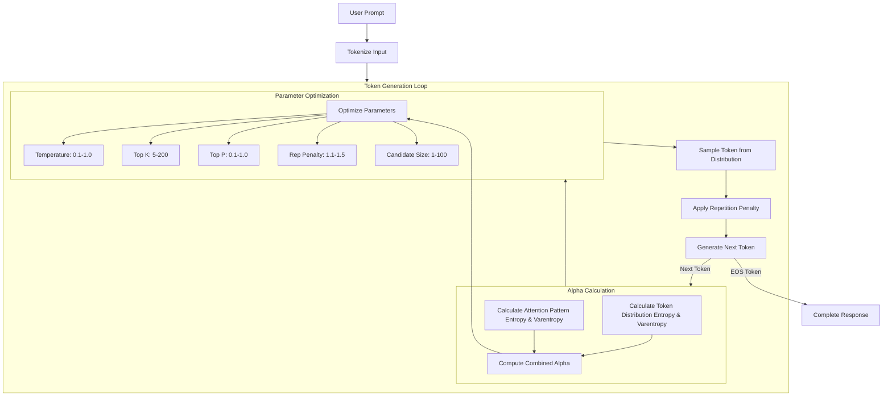

# AlphaSampler


is an advanced text generation sampling system that dynamically optimizes sampling parameters based on entropy and attention patterns. It provides more controlled and context-aware text generation by adaptively adjusting sampling parameters during the generation process.

## Features

- **Dynamic Parameter Optimization**: Automatically adjusts temperature, top-k, top-p, repetition penalty, and candidate size based on context
- **Entropy-Based Analysis**: Utilizes both token distribution and attention pattern entropy
- **Moving Average Window**: Maintains stability through alpha value smoothing
- **Comprehensive Error Handling**: Robust error checking and logging throughout the pipeline
- **Compatible with Hugging Face Models**: Works with AutoModelForCausalLM models

## Requirements

```python
torch
transformers
logging
typing
```

## Installation

1. Clone the repository
2. Install dependencies:
```bash
pip install torch transformers
```

## Quick Start

```python
from transformers import AutoModelForCausalLM, AutoTokenizer
from alpha import generate_response

# Initialize model and tokenizer
model_name = "Qwen/Qwen2.5-0.5B-Instruct"
model = AutoModelForCausalLM.from_pretrained(model_name, output_attentions=True)
tokenizer = AutoTokenizer.from_pretrained(model_name)

# Generate text
prompt = "Your prompt here"
response = generate_response(model, tokenizer, prompt)
print(response)
```

## Core Components

### SamplerConfig

Configuration class that defines:
- Base parameters for sampling
- Parameter bounds
- Optimization settings
- Smoothing factors

```python
cfg = SamplerConfig()
cfg.base_temp = 0.2
cfg.base_top_p = 0.80
# ... other configurations
```

### AdaptiveEntropixSampler

Main sampling class with the following key methods:

1. `calculate_alpha`: Computes the adaptive scaling factor using:
   - Token distribution entropy
   - Token distribution varentropy
   - Attention pattern entropy
   - Attention pattern varentropy

2. `find_optimal_parameters`: Optimizes sampling parameters based on:
   - Current alpha value
   - Parameter bounds
   - Gradient-based optimization

3. `sample`: Main sampling method that:
   - Applies all optimized parameters
   - Handles repetition penalty
   - Generates next token probabilities

## Parameter Ranges

| Parameter | Min | Max | Description |
|-----------|-----|-----|-------------|
| Temperature | 0.1 | 1.0 | Controls randomness |
| Top-K | 5 | 200 | Number of top tokens to consider |
| Top-P | 0.1 | 1.0 | Cumulative probability threshold |
| Repetition Penalty | 1.1 | 1.5 | Penalty for repeated tokens |
| Candidate Size | 1 | 100 | Final pool of candidates |

## Generation Flow



## Error Handling

The system includes comprehensive error handling:
- Input validation
- Tensor shape verification
- Parameter bound checking
- Logging at multiple levels
- Graceful fallbacks

## Logging

The system uses Python's built-in logging module with configurable levels:
```python
logging.basicConfig(level=logging.INFO,
                   format='%(asctime)s - %(levelname)s - %(message)s')
```

